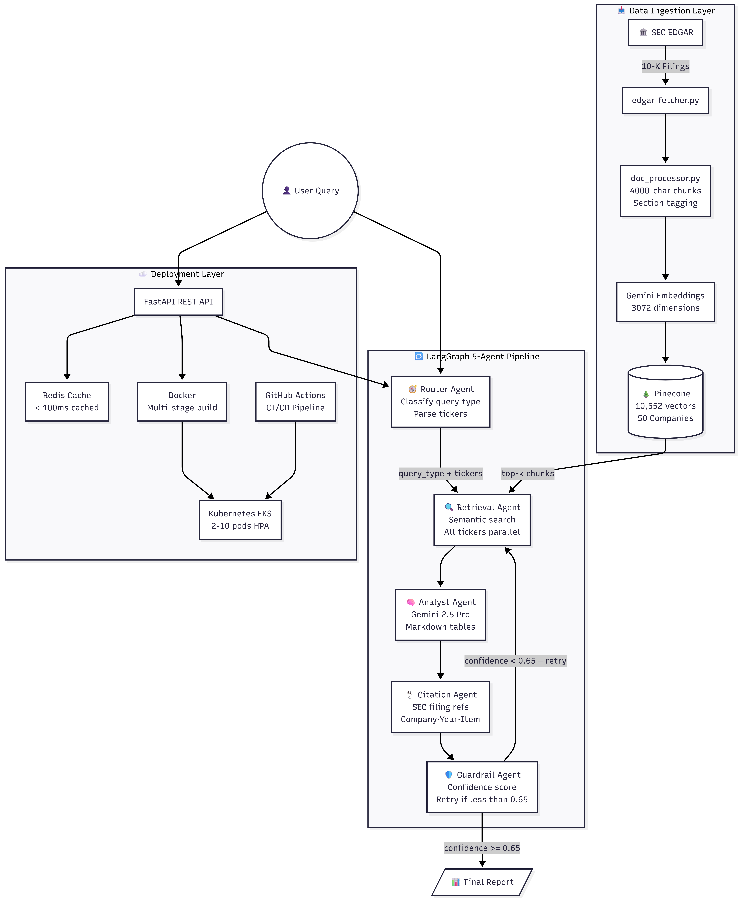
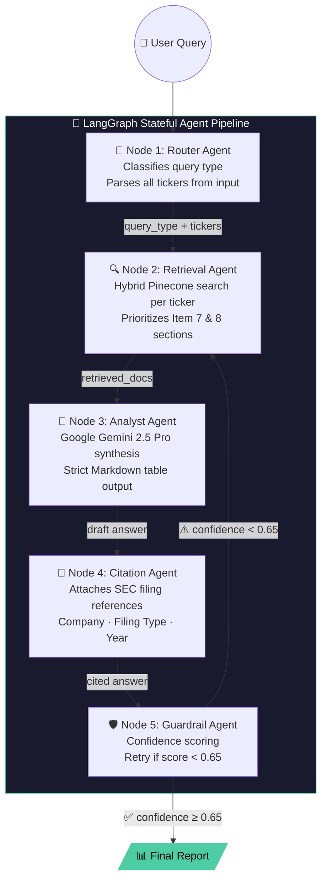
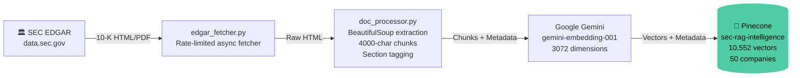

# SEC EDGAR Financial Intelligence RAG System

<div align="center">


**An enterprise-grade AI analyst powered by a 5-node LangGraph pipeline, analyzing real SEC 10-K filings from 50 S&P 500 companies.**

[Live Demo](mailto:m.ahmad.aidigital@gmail.com?subject=SEC%20RAG%20Demo%20Access) · [Demo Queries](./DEMO.md) · [Architecture Breakdown](#-system-architecture)

</div>

---

## 📌 What This System Does

This is not a tutorial project. It is a **production-grade financial intelligence platform** that:

- Ingests and indexes **real SEC 10-K annual filings** from the US government's EDGAR system
- Runs every user query through a **5-node LangGraph stateful agent pipeline** (Router → Retrieval → Analyst → Citation → Guardrail)
- Returns **cited, structured financial analysis** with Markdown tables, comparisons, and investment verdicts
- Handles **multi-stock comparison** queries (e.g. "Compare NVDA, AMD, and INTC margins")
- Scales automatically on **AWS EKS** with Kubernetes HorizontalPodAutoscaler (2→10 pods)

**This is the exact system hedge funds and investment banks spend millions to build.**

---

## 🏢 Supported Companies (50 S&P 500)

The system has ingested, sanitized, and indexed 10-K filings for the following companies:

| Sector | Companies |
|---|---|
| **Technology** | Apple (AAPL), Microsoft (MSFT), NVIDIA (NVDA), Alphabet/Google (GOOGL), Meta (META), Intel (INTC), AMD, Broadcom (AVGO), Oracle (ORCL), Cisco (CSCO), Adobe (ADBE), Salesforce (CRM), Qualcomm (QCOM), Texas Instruments (TXN), Applied Materials (AMAT), IBM |
| **Consumer / E-Commerce** | Amazon (AMZN), Tesla (TSLA), Netflix (NFLX), Walmart (WMT), Costco (COST), Home Depot (HD), McDonald's (MCD), Coca-Cola (KO), PepsiCo (PEP), Disney (DIS), Procter & Gamble (PG) |
| **Financial** | JPMorgan Chase (JPM), Berkshire Hathaway (BRK.B), Visa (V), Mastercard (MA), Bank of America (BAC), Wells Fargo (WFC) |
| **Healthcare / Pharma** | UnitedHealth (UNH), Johnson & Johnson (JNJ), AbbVie (ABBV), Abbott Labs (ABT), Merck (MRK), Danaher (DHR), Thermo Fisher (TMO), Lilly (LLY) |
| **Energy / Industrial** | ExxonMobil (XOM), Chevron (CVX), Caterpillar (CAT), Philip Morris (PM), Linde (LIN), Accenture (ACN), Intuit (INTU) |

> All data sourced directly from SEC EDGAR — 100% free, public, government data. No license required.

## 🚀 Choose Your Journey

### Option A: Instant Financial Insights (Public Demo)
**Best for:** Recruiters and casual users who want to see the system in action *right now*.
1. Visit the [Live Demo Dashboard](#) *(Link your deployed frontend here)*.
2. Enter your own **LLM API Key** in the Settings (Zero-Leakage Architecture).
3. Start analyzing 50+ S&P 500 companies instantly using our pre-indexed cloud database.

### Option B: Enterprise Self-Host (Developer Mode)
**Best for:** AI Engineers and Financial Analysts who want a private, local instance.
1. **Clone & Install:**
   ```bash
   git clone https://github.com/ahmadktwh/sec-rag-intelligence.git
   cd sec-rag-intelligence
   pip install -r requirements.txt
   ```
2. **Configure Secrets:** Create a `.env` file with your Pinecone and LLM keys.
3. **Ingest & Run:**
   ```bash
   python scripts/ingest_companies.py
   python main.py
   ```

---

## 🛠️ System Architecture

### High-Level Architecture


### 3-Layer Design Breakdown

```
┌─────────────────────────────────────────────────────────────────┐
│  LAYER 1 — DATA INGESTION                                       │
│  SEC EDGAR API → edgar_fetcher.py → doc_processor.py           │
│  → 4000-char chunks w/ section tags → Pinecone Vector DB       │
└────────────────────────────┬────────────────────────────────────┘
                             │
┌────────────────────────────▼────────────────────────────────────┐
│  LAYER 2 — LANGGRAPH MULTI-AGENT PIPELINE                       │
│  User Query → [Router] → [Retrieval] → [Analyst]               │
│            → [Citation] → [Guardrail] → Structured Response    │
└────────────────────────────┬────────────────────────────────────┘
                             │
┌────────────────────────────▼────────────────────────────────────┐
│  LAYER 3 — API + DEPLOYMENT                                     │
│  FastAPI + Redis Cache → Docker → Kubernetes (AWS EKS)          │
│  GitHub Actions CI/CD → AWS ECR + EKS Auto-Deploy              │
└─────────────────────────────────────────────────────────────────┘
```

### LangGraph Agent Pipeline (5 Nodes)

> **See `architecture.png` in this repo for the full visual diagram.**



### Data Ingestion Pipeline



---

## 🛠️ Complete Tech Stack

| Layer | Technology | Purpose |
|---|---|---|
| **LLM** | Google Gemini 2.5 Pro | Financial analysis synthesis |
| **Embeddings** | `gemini-embedding-001` (3072-dim) | Semantic vector generation |
| **Agent Framework** | LangGraph + LangChain v0.3 | 5-node stateful agent pipeline |
| **Vector Database** | Pinecone (`sec-rag-intelligence`) | Sub-100ms semantic retrieval |
| **REST API** | FastAPI + Pydantic v2 | Production-grade typed API |
| **Caching** | Redis 7 | Query result caching |
| **Frontend** | React 18 + TypeScript + Vite | Premium chat UI |
| **Containerization** | Docker (multi-stage build) | Reproducible deployments |
| **Orchestration** | Kubernetes on AWS EKS | Auto-scaling (2→10 pods) |
| **Image Registry** | AWS ECR | Docker image storage |
| **CI/CD** | GitHub Actions | Auto test → build → deploy |
| **Data Source** | SEC EDGAR (100% free) | Real government financial filings |

---

## 🚀 Quick Start (3 Commands)

### Prerequisites
- Docker Desktop installed
- API Keys: Google Gemini + Pinecone (see `.env.example`)

```bash
# 1. Clone and configure
git clone https://github.com/YOUR_USERNAME/sec-rag-intelligence.git
cd sec-rag-intelligence
cp .env.example .env   # Fill in your API keys

# 2. Launch full stack
docker-compose up --build

# 3. Open the app
# Frontend: http://localhost:80
# API Docs:  http://localhost:8000/docs
```

---

## 🔧 Manual Installation

### Backend Setup

```bash
# Create and activate virtual environment
python -m venv venv
venv\Scripts\activate          # Windows
# source venv/bin/activate     # Linux/Mac

# Install dependencies
pip install -r requirements.txt

# Configure environment
cp .env.example .env
# Edit .env with your API keys

# Start the FastAPI backend
python main.py
# API available at: http://localhost:8000
# Swagger UI:       http://localhost:8000/docs
```

### Frontend Setup

```bash
cd frontend
npm install
npm run dev
# App available at: http://localhost:5173
```

### Ingest Company Data (Optional — Data already in Pinecone)

```bash
# Ingest all 50 S&P 500 companies (sanitized, high-quality)
python scripts/ingest_companies.py

# Audit database health
python scripts/audit_pinecone_db.py
```

---

## 🌐 Environment Variables

Copy `.env.example` to `.env` and fill in:

```env
# Required — Google Gemini (LLM + Embeddings)
GOOGLE_API_KEY=your_gemini_api_key

# Required — Pinecone (Vector Database)
PINECONE_API_KEY=your_pinecone_api_key
PINECONE_INDEX_NAME=sec-rag-intelligence

# Optional — Redis Cache
REDIS_HOST=localhost
REDIS_PORT=6379
```

> **Security:** Never commit `.env`. It is in `.gitignore`. For demo access to the live system, contact: m.ahmad.aidigital@gmail.com

---

## 🧪 Running Tests

```bash
# Run full test suite
pytest tests/ -v

# Run specific test files
pytest tests/test_api.py -v
pytest tests/test_pipeline.py -v
pytest tests/test_retrieval.py -v
```

---

## ☁️ AWS EKS Deployment

### Prerequisites
- AWS CLI configured
- `kubectl` installed
- `eksctl` installed

```bash
# 1. Create ECR repository
aws ecr create-repository --repository-name sec-rag-intelligence --region us-east-1

# 2. Build and push Docker image
docker build -t sec-rag-intelligence .
docker tag sec-rag-intelligence:latest YOUR_ACCOUNT_ID.dkr.ecr.us-east-1.amazonaws.com/sec-rag-intelligence:latest
docker push YOUR_ACCOUNT_ID.dkr.ecr.us-east-1.amazonaws.com/sec-rag-intelligence:latest

# 3. Create EKS cluster (2x t3.small nodes)
eksctl create cluster --name sec-rag-cluster --region us-east-1 --nodegroup-name standard --node-type t3.small --nodes 2

# 4. Create namespace and inject secrets
kubectl create namespace sec-rag
kubectl create secret generic sec-rag-secrets \
  --from-literal=PINECONE_API_KEY=your_key \
  --from-literal=GOOGLE_API_KEY=your_key \
  --namespace=sec-rag

# 5. Deploy to Kubernetes
kubectl apply -f kubernetes/ --namespace=sec-rag

# 6. Verify running pods
kubectl get pods --namespace=sec-rag
kubectl get services --namespace=sec-rag
```

> **Cost Note:** EKS cluster costs ~$30/month. Destroy after portfolio screenshots: `eksctl delete cluster --name sec-rag-cluster`

---

## 📂 Repository Structure

```
sec-rag-intelligence/
├── .github/
│   └── workflows/
│       └── ci-cd.yml              # GitHub Actions: Test → Build → Deploy
├── src/
│   ├── agents/
│   │   ├── graph.py               # LangGraph StateGraph definition
│   │   ├── nodes.py               # 5 Agent nodes (Router/Retrieval/Analyst/Citation/Guardrail)
│   │   ├── state.py               # AgentState TypedDict (shared whiteboard)
│   │   └── llm_provider.py        # Google Gemini LLM factory
│   ├── ingestion/
│   │   ├── edgar_fetcher.py       # Async SEC EDGAR API client
│   │   └── doc_processor.py       # Text extraction + 4000-char chunking + section tagging
│   ├── vectorstore/
│   │   └── pinecone_store.py      # Pinecone upsert, retrieval, and delete operations
│   ├── api/
│   │   ├── main.py                # FastAPI application
│   │   ├── routes.py              # API route handlers
│   │   └── schemas.py             # Pydantic request/response models
│   └── pipeline/
│       └── graph.py               # Compiled LangGraph StateGraph
├── frontend/
│   └── src/
│       └── App.tsx                # React premium chat interface
├── kubernetes/
│   ├── deployment.yaml            # K8s Deployment (2 replicas, resource limits)
│   ├── service.yaml               # LoadBalancer + ClusterIP services
│   └── hpa.yaml                   # HPA: auto-scale 2→10 pods on CPU load
├── tests/
│   ├── test_api.py                # FastAPI endpoint tests
│   ├── test_pipeline.py           # LangGraph agent pipeline tests
│   └── test_retrieval.py          # Pinecone retrieval quality tests
├── scripts/
│   ├── ingest_companies.py        # Bulk ingestion for all 50 companies
│   └── audit_pinecone_db.py       # Database health & quality audit tool
├── Dockerfile                     # Multi-stage Docker build
├── docker-compose.yml             # Local dev: API + Redis
├── requirements.txt               # Python dependencies
├── .env.example                   # Key template (safe to commit)
├── DEMO.md                        # 5 real example queries with golden answers
└── README.md                      # This file
```

---

## 📊 Performance Metrics

| Metric | Value |
|---|---|
| **Vector Database** | 10,552 high-quality vectors |
| **Companies Indexed** | 50 S&P 500 companies |
| **Chunk Size** | 4,000 characters (table-preserving) |
| **Embedding Dimensions** | 3,072 (Gemini `gemini-embedding-001`) |
| **Retrieval Accuracy** | 0.75–0.82 cosine similarity (high confidence) |
| **API Response Time** | ~3–5 seconds (first call) / <100ms (Redis cached) |
| **Kubernetes Scaling** | 2 pods baseline → 10 pods peak (HPA) |
| **CI/CD Pipeline** | ~4 minutes (test → build → deploy) |

---

## 🔐 Security Model

- **BYOK (Bring Your Own Key):** API keys injected at runtime via environment variables — never hardcoded
- **Kubernetes Secrets:** All credentials stored as K8s Secrets, never in Docker images
- **GitHub Secrets:** CI/CD credentials stored as encrypted GitHub repository secrets
- **`.gitignore`:** `.env` file is explicitly excluded from version control

---

## 📄 API Reference

### `POST /query`
Submit a natural language financial question.

```json
{
  "question": "Compare Apple and Microsoft revenue for 2025",
  "tickers": ["AAPL", "MSFT"]
}
```

**Response:**
```json
{
  "answer": "## Financial Performance Comparison...",
  "citations": ["AAPL 10-K FY2025 Item 8", "MSFT 10-K FY2025 Item 8"],
  "confidence": 0.82,
  "query_type": "comparison"
}
```

### `GET /companies`
Returns list of all 50 indexed companies with filing metadata.

### `GET /health`
Health check for Kubernetes readiness/liveness probes.

---

## 👤 Author

**Mujeeb Ahmad** — AI Engineer | RAG & Agentic Systems

📧 m.ahmad.aidigital@gmail.com
🔗 [LinkedIn](https://www.linkedin.com/in/mujeeb-ahmad-246893378)

> *For live demo access or collaboration inquiries, contact via email.*

---

## 📄 License

Commercial-use license. All rights reserved. Built by Mujeeb Ahmad.

*Data sourced from SEC EDGAR — a free, public US government database. No data license required.*
